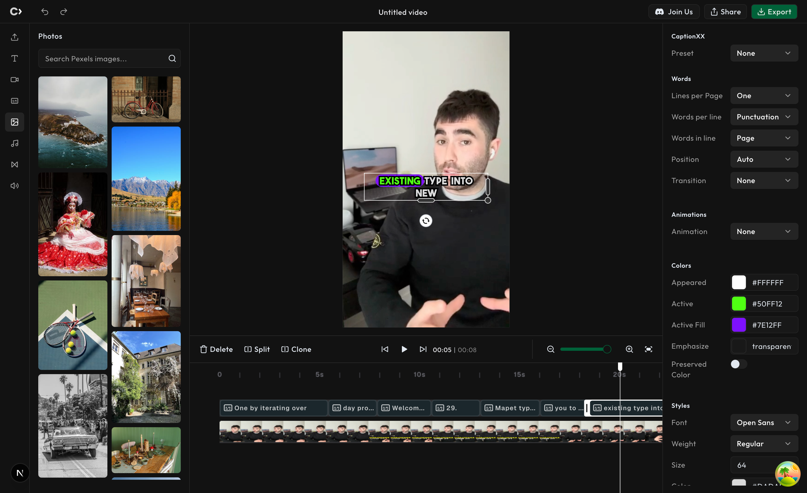

<p align="center">
  <a href="https://github.com/designcombo/react-video-editor">
    
  </a>
</p>
<h1 align="center">React Video Editor</h1>

<div align="center">
  
Video Editor application using React and TypeScript.

<p align="center">
    <a href="https://designcombo.dev/">Combo</a>
    ·  
    <a href="https://discord.gg/jrZs3wZyM5">Discord</a>
    ·  
    <a href="https://github.com/designcombo/react-video-editor">X</a>
</p>
</div>

[](https://github.com/designcombo/react-video-editor)

## 📖 Bản D1A Motion Editor — hướng dẫn

- **[HOW-TO-USE.md](HOW-TO-USE.md)** — cách dùng end-to-end: script + video → Short hoàn chỉnh (AI làm hộ hoặc tự dựng), 49 kind, render, chuẩn bị asset.
- **[HOW-TO-START.md](HOW-TO-START.md)** — cài đặt lần đầu.
- **[src/brand-docs/HOW-TO-ADD-MOTION.md](src/brand-docs/HOW-TO-ADD-MOTION.md)** — thêm kind motion mới (cho dev).
- **`.claude/skills/edit-video-taste/motion-edit-craft/`** — skill AI: tri thức biên tập/taste + workflow + design-schema.

## ✨ Features

- 🎬 Timeline Editing: Arrange and trim media on a visual timeline.
- 🌟 Effects and Transitions: Apply visual effects, filters, and transitions.
- 🔀 Multi-track Support: Edit multiple video and audio tracks simultaneously.
- 📤 Export Options: Save videos in various resolutions and formats.
- 👀 Real-time Preview: See immediate previews of edits.

## 🚀 See It in Action

Check out the deployed version here: [React Video Editor Live Demo](https://video.designcombo.dev/)

## ⌨️ Development

### Environment Variables

Create a `.env` file in the project root and add the following:

```env
PEXELS_API_KEY=""
```

Clone locally:

```bash
git clone git@github.com:designcombo/react-video-editor.git
cd react-video-editor
pnpm install
pnpm dev
```

Open your browser and visit http://localhost:3000 , see more at [Development](https://github.com/designcombo/react-video-editor).

## 📝 License

Copyright © 2025 [DesignCombo](https://designcombo.dev/).
